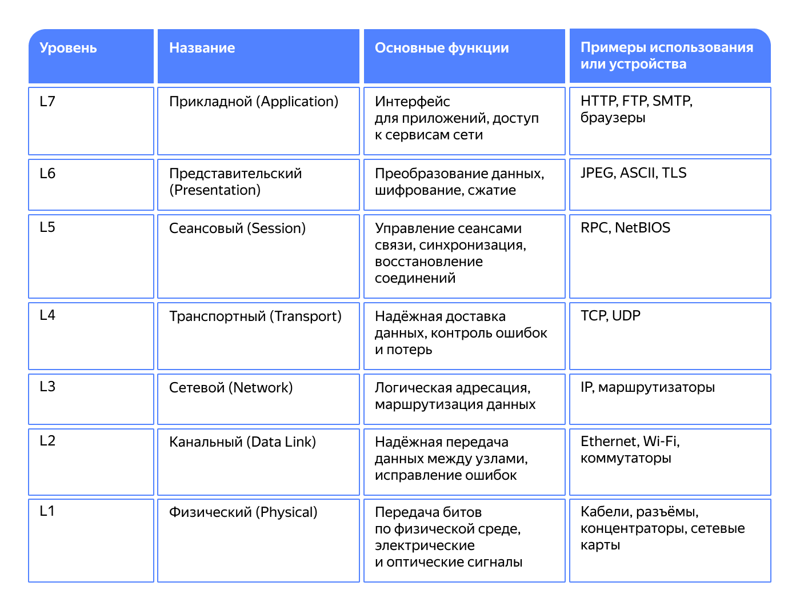

# Основы устройства сети

__OSI (open systems interconnection)__ - `Это не строгий стандарт, а просто концепция
которая помогает понять, как работают сети и как компуктеры обмениваются данными`

## Существуют 7 уровней OSI

## Ip address

просто уникальный индификатор устройства внутри сети
Ip адрес начинает использоваться уже на 3 уровне OSI

__SIDR (бесклассовая адресация)__ - `способ записи ip адреосв, который используется для
эффективного управления ими`

короче, с помощью этого способа DHCP раздает уникальные идентификаторы внутри 
локальной сети, например

## DNS
просто штука для присвоения имени конкретным айпи адресам
когда на сайт заходишь, происходит примерно такой процесс:
1. Компуктер проверяет, есть ли уже ip адрес для этого dns сервера
2. Если нет, то тогда комп обращается к провайдеру, у которого там есть сервисы
DNS рекурсора (компонент, отвечающий за поиск ip адреса)
3. Запрос к корневому серверу, если рекурсор не знает, то он запрашивает информацию у
корневых серверов. Корневые серверы - отправная точка, которая отправляет запросы к соответствующей зоне
4. Запросы к серверу верхнего уровня (TLD) - Корневой сервер перенаправляет запросы
на серверы верхнего уровня доменов (например, ru, org, com...). содержат информацию о DNS-серверах, которые являются 
авторитетными для доменов второго уровня (ya.ru, mos.ru и не только).
5. Запрос к авторитетному серверу домена - запрос передается на этот авторитетный сервер,
который обладает всей инфой об этом DNS, в том числе и точным ip адресов
6. Авторитетный сервер возвращает ip адрес сервера, после чего компуктер подключается к нужному серверу

## TCP (Transmission Control Protocol) протокол
он обеспечивает точность отправки данных. По такому протоколу данные приходят без потерь
подходит для тех сервисов, где важна точность, например: отправка сообщений

* установление рукопожатие. Используется трехстороннее рукопожатие, где сначала две стороны
подтверждают связь
* Контроль целостности. Если данные теряются, то протокол TCP кидает еще один запрос ретраи типа
* TCP следит за порядком передачи данных 
* Контроль потока. TCP контролирует скорость передачи, чтобы избежать перегрузки сети

## UDP (User Datagram Protocol) 
более простой и быстрый протокол передачи, чем TCP, но при этом он менее надежный
Он необеспечивает проверку передачи данных 
* UDP не требует предварительного установления соединения между устройствами
* Данные могут быть дублированными, потерянными или доставлены в неверном порядке
* Благодаря отсутствию проверок UDP быстрее передает данные. Обеспечивает минимальные задержки при передачи данных

## NAT шлюзы
думаю, что не буду тут много расписывать. Суть в том, что эти шлюзы прописываются, для того, чтобы 
устройства с приватными полями могли пользоваться доступом в интернет через какой-то публичный. Это позволяет экономить публичный ip адреса

## NAT-инстанс
по сути тоже самое, что и NAT шлюзы, только это вм получается с более гибкой настройкой

## Дальше про балансировку нагрузки 

Network Load Balancer (NLB)
Это балансировщик транспортного уровня (L4 модели OSI). Он работает на уровне транспортного протокола (TCP/UDP) и пересылает трафик на заданные IP-адреса и порты. Его особенности:
быстро запускается и требует минимума настроек;
не анализирует содержимое запроса;
подходит для балансировки баз данных, gRPC, SSH и других протоколов.
Application Load Balancer (ALB)
Это балансировщик уровня приложений (L7 модели OSI). Он работает на уровне HTTP/HTTPS и может анализировать заголовки, URI, методы запросов. Его особенности:
можно настраивать правила маршрутизации (например, /api направляется на одни серверы, а /admin — на другие);
поддерживает HTTPS-терминирование, то есть установку HTTPS-соединения;
может работать с cookie, заголовками, проверять состояние приложения через HTTP.